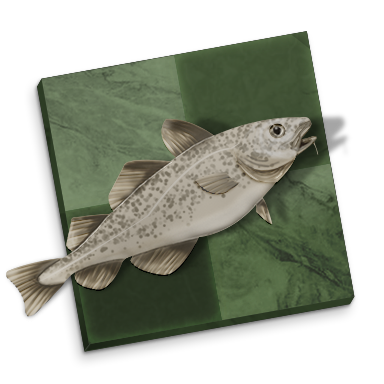
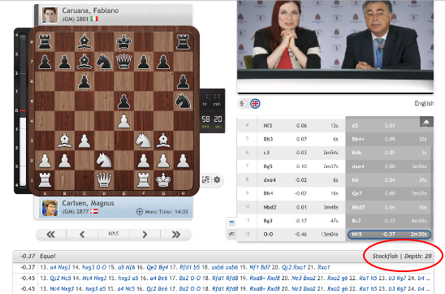
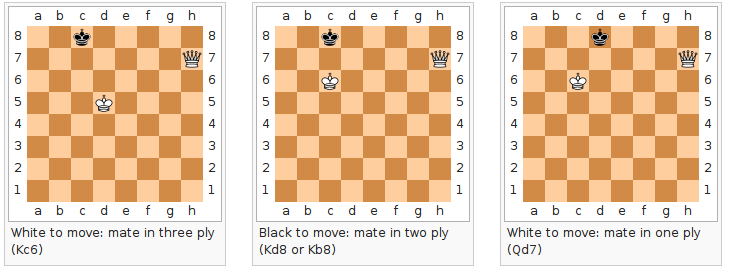
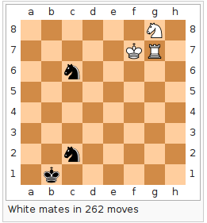
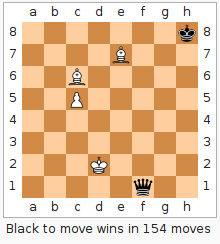
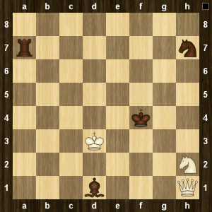
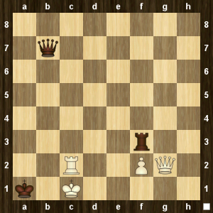
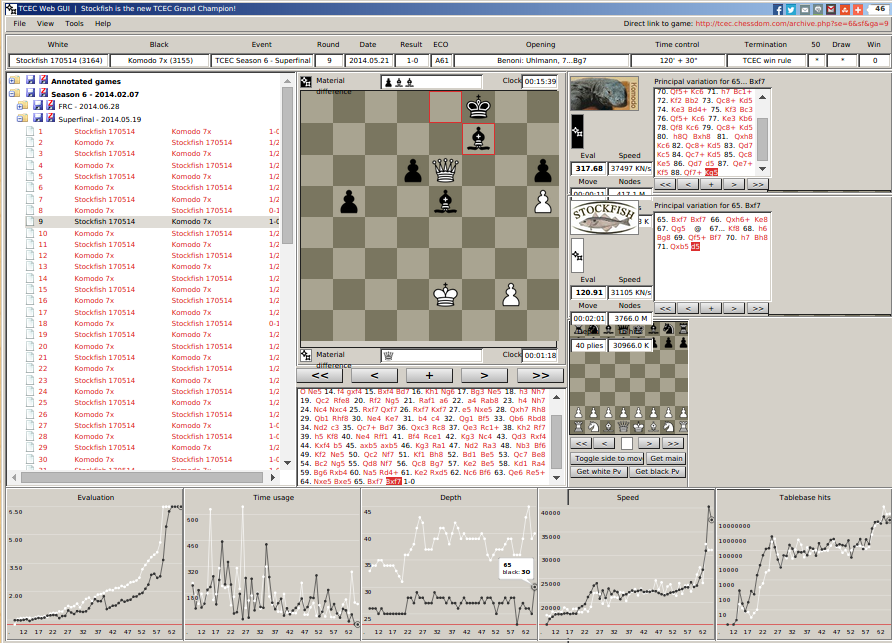
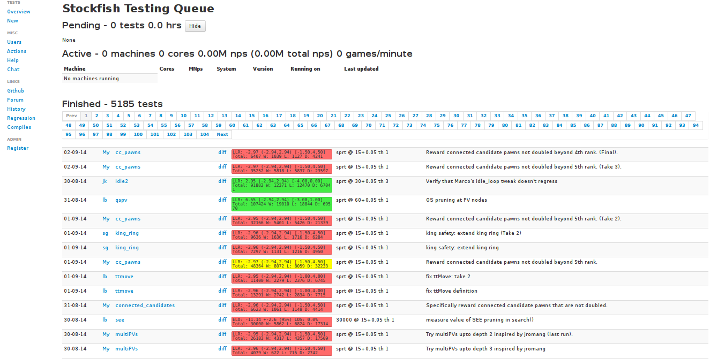
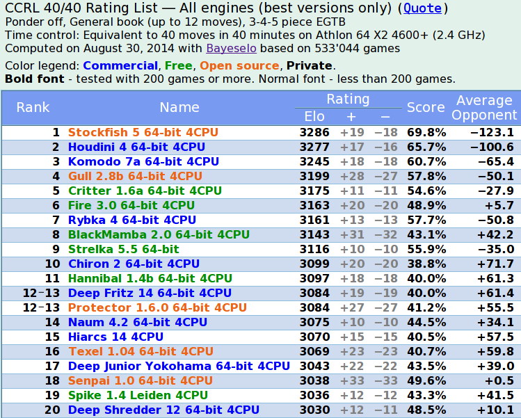

<!-- configuracion de colores es opcional pero ultil-->
<section id="themes">
	<h2>Configuración de temas</h2>
	<p>
		Temas: <br>
		<a href="?#/themes">Default</a> -
		<a href="?theme=sky#/themes">Sky</a> -
		<a href="?theme=beige#/themes">Beige</a> -
		<a href="?theme=simple#/themes">Simple</a> -
		<a href="?theme=serif#/themes">Serif</a> -
		<a href="?theme=night#/themes">Night</a> <br>
		<a href="?theme=moon#/themes">Moon</a> -
		<a href="?theme=solarized#/themes">Solarized</a>
	</p>
</section>

Slide:

# Mi caso acerca de Stockfish

Jean Pierre Charalambos



Slide:



Slide:

# Indice

## Nociones

## Computer chess

## Stockfish

Slide:

# Nociones

1. ELO rating
2. Table-bases
3. Otras: reglas especiales, pondering, etc.

Subslide:

## Nociones
### ELO-Rating

\begin{equation}
dE=K*(S-1/(10^{(-D/F)+1}))
\end{equation}

donde, para cada jugador:

* $dE$ : Puntos ELO pendientes <!-- .element: class="fragment" data-fragment-index="1"-->
* $S$ : Resultado (1 = gana, 0 = pierde, 0.5 = tablas) <!-- .element: class="fragment" data-fragment-index="2"-->
* $F$ : F factor (disparidad del rating) = 400: entre mas grande sea F, más fácil resulta ganar (o perder) puntos <!-- .element: class="fragment" data-fragment-index="3"-->
* $D$ : Diferencia de ELO entre los dos jugadores <!-- .element: class="fragment" data-fragment-index="4"-->
* $K$ : K Factor (importancia del juego), calculada como: <!-- .element: class="fragment" data-fragment-index="5"-->
    1. El ELO de uno de los jugadores es < 2100, -> $K = 32$
    2. El ELO de uno de los jugadores es < 2401, -> $K = 24$
    3. El ELO de ambos jugadores es > 2400, -> $K = 16$

Subslide:

## Nociones
### ELO-Rating: Ejemplo

Juan tiene 2234 puntos ELO y Pedro 2456.

* Si Juan gana -> Juan +19 y Pedro -19
* Si Pedro gana -> Juan -5 y Pedro +5
* Tablas -> Juan +7 y Pedro -7

Subslide:

## Nociones
### Table-bases

* Bases de datos de finales de partida
* Cálculos precisos para el juego óptimo en cualquier posición
* Siempre que No. piezas <= límite determinado

Subslide:

## Nociones
### Table-bases

Generación por retro-análisis



Subslide:

## Nociones
### Table-bases

* 4 Piezas -> finales 80's <!-- .element: class="fragment" data-fragment-index="1"-->
* 5 Piezas -> Inicios 90's <!-- .element: class="fragment" data-fragment-index="2"-->
* 6 Piezas -> 2005 Nalimov <!-- .element: class="fragment" data-fragment-index="3"-->
* 6 Piezas -> 2013 Syzygy, [Ronald the Man, alias Ron] <!-- .element: class="fragment" data-fragment-index="4"-->
* 7 Piezas (100 TB) -> 2012 Lomonosov [Vladimir Makhnychev and Victor Zakharov from Moscow State University] <!-- .element: class="fragment" data-fragment-index="5"-->

Subslide:

## Nociones
### Table-bases: Ejemplos



Subslide:

## Nociones
### Table-bases: Ejemplos



Subslide:

## Nociones
### Table-bases: Ejemplos

Negras mueven y pierden en 545 turnos



Subslide:

## Nociones
### Table-bases: Ejemplos

Zugswang en ambos lados



Subslide:

## Nociones
### Bono: En passant


Slide:

# Computer Chess

1. The Turk
2. Cronología
4. TCEC

Subslide:

## Computer Chess
### 1769 – Wolfgang von Kempelen: The Turk


Grabado de [Karl Gottlieb von Windisch](http://en.wikipedia.org/wiki/Karl_Gottlieb_von_Windisch) de 1784

Subslide:

## Computer Chess
### 1769 – Wolfgang von Kempelen: The Turk


Grabado atribuido al propio [Kempelen](http://en.wikipedia.org/wiki/Wolfgang_von_Kempelen)

Subslide:

## Computer Chess
### 1769 – Wolfgang von Kempelen: The Turk


Reconstrucción moderna del Turk

Subslide:

## Computer Chess
### Cronología

* 1948 – Norbert Wiener "Cybernetics": eval fx, minimax simp.<!-- .element: class="fragment" data-fragment-index="1"-->
* 1951 – Alan Turing: 1er programa<!-- .element: class="fragment" data-fragment-index="2"-->
* 1956 – John McCarthy: alpha-beta<!-- .element: class="fragment" data-fragment-index="3"-->
* 1996 – Deep blue (2) vs Kasparov (4)<!-- .element: class="fragment" data-fragment-index="4"-->
* 1997 – Deeper blue (3½) vs Kasparov (2½)<!-- .element: class="fragment" data-fragment-index="5"-->
* 2005 – Rybka campeón del mundo<!-- .element: class="fragment" data-fragment-index="6"-->
* 2006 – Kramnik (2) vs Deep Fritz (4)<!-- .element: class="fragment" data-fragment-index="7"-->
* 2011 – Rybka es destronada por plagio<!-- .element: class="fragment" data-fragment-index="8"-->

Note:
* Deep blue -> Kasparov -> IBM of cheating: using human player. Asked for log but no logs.
* Deep Fritz -> switch from hardware to software
* Vasik Rajlich -> Crafty y Fruit (oss). No atribución. Expulsado de por vida y devolucion. [Zach Wegner]

Subslide:

## Computer Chess
### TCEC: Características

* Martin Thoresen (2010)
* Participantes de élite
* Control de tiempo largo: 120+30
* Pondering: off
* Apoyado por los autores originales de los programas
* Con base en voluntarismo y donación

Subslide:

## Computer Chess
### TCEC: Computador

```
CPUs: 2 x 8 core Intel Xeon E5-2689 @ 3300 MHz
CPU Coolers: 2 x Corsair H80i
Motherboard: Asus Z9PE-D8 WS
RAM: 64 GB Kingston KVR16R11D4K4/32 Reg/ECC
PSU: Corsair AX 760
SSDs: 2 x Samsung 840 Pro 128 GB @ Raid 0
Case: Silverstone Raven RV03B-WA
```

Subslide:

## Computer Chess
### TCEC: Configuración

```
Graphical User Interface (GUI): cutechess-cli (custom)
Protocol: Winboard, UCI
Large Pages: OFF
Number of Cores/Threads (per engine): 8 or 16
Split Depth: DEFAULT
Main Hash Size: 16 GB (Maximum)
Minor Hash Size: 1 GB
Engine Opening Book: OFF
Endgame Tablebases: 6-men Syzygy
Tablebase Cache: 1024 MB (Maximum)
Ponder/Permanent Brain: OFF
Contempt/Draw Score: DEFAULT
```

Note:
Platicar acerca del opening-book y la selección de aperturas (hasta el mov 10)

Subslide:

## Computer Chess
### TCEC: Reglas de adjudicación

* Tablas: Triple repetición de posición
* Tablas: Regla de los 40 movimientos
* Tablas: Si _mov_ > 40 y -0-05 _eval_ < +0.05 para ambos jugadores, 10 plies consecutivos
* Gana: _eval_ > 6.5, para ambos jugadores, 10 plies consecutivos

Note:
Platicar acerca del sistema de evaluación: # peones

Subslide:

## Computer Chess
### TCEC: interfaz



Interfaz online de TCEC

Subslide:

## Computer Chess
### TCEC: Standings

| Temporada     | Fecha               | Campeón          | Subcampeón       |
|---------------|---------------------|------------------|------------------|
| TCEC Season 1 | Dec 2010 – Feb 2011 | Houdini 1.5a     | Rybka 4.0        |
| TCEC Season 2 | Feb 2011 – Apr 2011 | Houdini 1.5a     | Rybka 4.1        |
| TCEC Season 3 | Apr 2011 – May 2011 | N/A              |                  |
| TCEC Season 4 | Jan 2013 – May 2013 | Houdini 3        | Stockfish 250413 |
| TCEC Season 5 | Aug 2013 – Dec 2013 | Komodo 1142      | Stockfish 191113 |
| TCEC Season 6 | Feb 2014 – May 2014 | Stockfish 170514 | Komodo 7x        |

Slide:

# Stockfish

1. Historia
2. Propiedades
3. Key
4. Gente

Subslide:

## Stockfish
### Historia

* [Tord Romstad] -> [Glaurung](https://chessprogramming.wikispaces.com/Glaurung) (2004)
* **Fork 1:** [Joona Kiiski] -> [Smaug](http://www.talkchess.com/forum/viewtopic.php?t=26971) (2009)
* **Fork 2:** [Marco Costalba] -> [Stockfish](https://chessprogramming.wikispaces.com/Stockfish) (2008)

Note:
Costalba es autor de [QGit](http://digilander.libero.it/mcostalba/)

Subslide:

## Stockfish
### Historia: Primeras reacciones

> Dear Tord,
> 
I admire for years your work about Glaurung. But the name of his successor is, I beg your pardon, is abominable, awful,
below the line of the minimal good taste. It seems a vulgar joke of barbare informaticiens of any culture. Transforming
in a joke the subtle and poetic "Rybka" to that other nickname, unpronounceable for me, is an insulte to the intelligence.
Please, choose the name of the new Norvegian hero (and future world champion, I'm sure) "Magnus" or anything else, but
let's leave for ever the norvegian fishmarket. Best, Laszlo

Note: 
Cita tomado del [foro de rybka](http://rybkaforum.net/cgi-bin/rybkaforum/topic_show.pl?tid=14670)

Subslide:

## Stockfish
### Propiedades

1. Tabla de transposición -> 1Tb
3. Poda agresiva: Búsqueda alpha-beta avanzada (LMR)
5. [Bitboards](https://chessprogramming.wikispaces.com/Bitboards)
6. Addon: [6 man Syzygy table bases](http://chessprogramming.wikispaces.com/Syzygy+Bases)

Note:
1. TT: (n!)² after n moves, hash table: memoization (hash table) -> search fx
2. LMR: Late move reductions:

Subslide:

## Stockfish
### Propiedades: poda alpha-beta

```
function alphabeta(node, depth, α, β, maximizingPlayer)
      if depth = 0 or node is a terminal node
          return the heuristic value of node
      if maximizingPlayer
          for each child of node
              α := max(α, alphabeta(child, depth - 1, α, β, FALSE))
              if β ≤ α
                  break (* β cut-off *)
          return α
      else
          for each child of node
              β := min(β, alphabeta(child, depth - 1, α, β, TRUE))
              if β ≤ α
                  break (* α cut-off *)
          return β
```

```
(* Initial call *)
alphabeta(origin, depth, -∞, +∞, TRUE)
```
    
Subslide:

## Stockfish
### Propiedades: poda alpha-beta


Note:
1. Assumption that good game-specific move ordering causes a program to search the most likely moves early.
2. LMR will reduce the search depth for moves searched later at a given node. This allows the program to search deeper along the critical lines.

Subslide:

## Stockfish
### propiedades: bitboars / bitsets / bitmaps


1. Representación interna del tablero de ajedrez
2. 64-bit word (o registro) -> cubre todo le tablero
3. Una palabra por pieza

Subslide:

## Stockfish
### Key

* Idea: plataforma de pruebas comunitaria<!-- .element: class="fragment" data-fragment-index="1"-->
    1. Probar ideas exhaustivamente
    2. Emplear procesadores en línea (workers)
* Implementación (2013)<!-- .element: class="fragment" data-fragment-index="2"-->
    1. [Git](http://git-scm.com/), [GitHub](https://github.com/)
    2. [Pyramid Web Framework](http://docs.pylonsproject.org/projects/pyramid/en/latest/), parte de [pylons](http://docs.pylonsproject.org/en/latest/)

Note:
* Formular la inquietud

Subslide:

## Stockfish
### Key: Fishtest

Ejecución de un "worker"

```
git clone https://github.com/glinscott/fishtest.git
#first launch:
python worker.py --concurrency 3 username password
#after the first access
python worker.py
#in linux
nohup python worker.py &
```

Subslide:

## Stockfish
### Key: Fishtest (parte a)

1. Setup inicial:<!-- .element: class="fragment" data-fragment-index="1"-->
    * Fork y clone this [repo](https://github.com/official-stockfish/Stockfish/fork)
2. Crear el test:<!-- .element: class="fragment" data-fragment-index="2"-->
    * `git checkout -b passed_pawns`
    * Edite sus cambios!
    * Compile: `make build ARCH=x86-64`
    * Tome la firma de `./stockfish bench`
    * Commit: `git commit -am "Mi cambio consiste en..."`
    * Push: `git push origin passed_pawns`

Subslide:

## Stockfish
### Key: Fishtest (parte b)

3. Run the test:
    * Vaya a [http://tests.stockfishchess.org/tests/run](http://tests.stockfishchess.org/tests/run)
    * Complete el "test branch" `passed_pawns`
    * Complete el "branch base"
    * Complete la descripción de su contribución
    * Click "run the test"
    * Si el test pasa, felicitaciones. Cree un [pull request](https://help.github.com/articles/creating-a-pull-request)
Note:
Pasar un test no garantiza que los cambios vean la luz, ver ste. slide

Subslide:

## Stockfish
### Key: Metodología

1. Directrices del contribuyente:<!-- .element: class="fragment" data-fragment-index="1"-->
    * [Cambios simples](http://tirania.org/blog/archive/2010/Dec-31.html), 1 test <-> 1 idea
    * Si el test pasa no es garantía del `merge`
    * Discuta las ideas en [fishcooking forum](https://groups.google.com/forum/#!forum/fishcooking)
2. Tipos de contribuciones:<!-- .element: class="fragment" data-fragment-index="2"-->
    * Standard: + ELO
    * Parameter tweaks
    * No-regression: bug fizes, depuración de código...
    * Cambios no funcionales: refactoring y speed

Subslide:

## Stockfish
### Key: Fishtest live site



Tomado de: [http://tests.stockfishchess.org/tests](http://tests.stockfishchess.org/tests) el 2/09/2014

Subslide:

## Stockfish
### Rankings actuales



Fuente: [CCRL (Computer Chess Rating Lists)](http://www.computerchess.org.uk/)

Subslide:

## Stockfish
### People

* Tord Romstad, Marco Costalba y Joona Kiiski
* [Gary Linscott](http://forwardcoding.com/)
* [Ronald the man](http://chessprogramming.wikispaces.com/Ronald+de+Man)
* [Comunidad](http://blog.stockfishchess.org/post/87376326602/stockfish-5)

Note:
1. Buscar interlocutores
2. Gente que hace y es activista

Slide:

# Resources

* [Stockfish](http://stockfishchess.org/)
* [Stockfish-gh](https://github.com/official-stockfish/Stockfish)
* [Stockfish-fishtest](https://github.com/glinscott/fishtest)
* [TCEC](http://tcec.chessdom.com/)
* [TCEC Superfinal - Round 9 : Stockfish vs Komodo](https://www.youtube.com/watch?v=oRztcrisum8)
* [TCEC Superfinal - Round 18 : Komodo vs Stockfish](https://www.youtube.com/watch?v=ZYCmOlp2ZU8)
* [Chess programming wiki](http://chessprogramming.wikispaces.com/)
* [Kasparov and the machine](http://topdocumentaryfilms.com/game-over-kasparov-and-the-machine/)