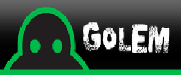
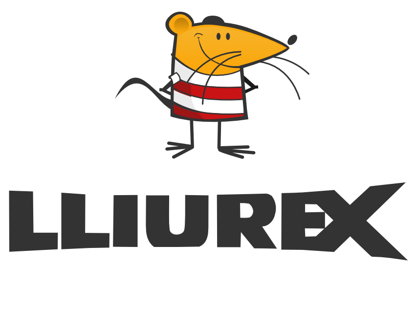
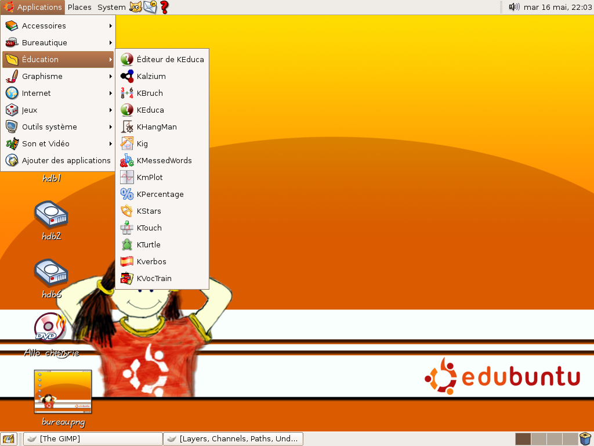
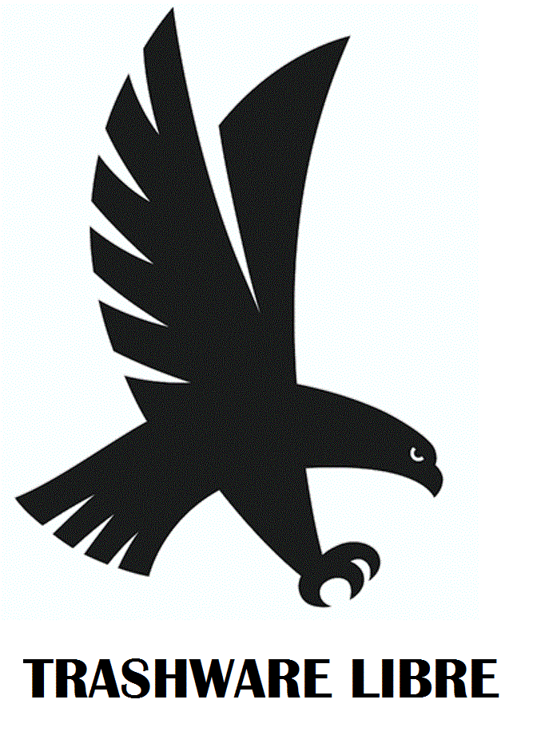
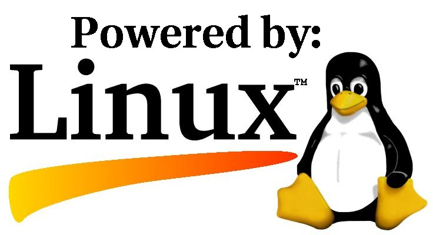
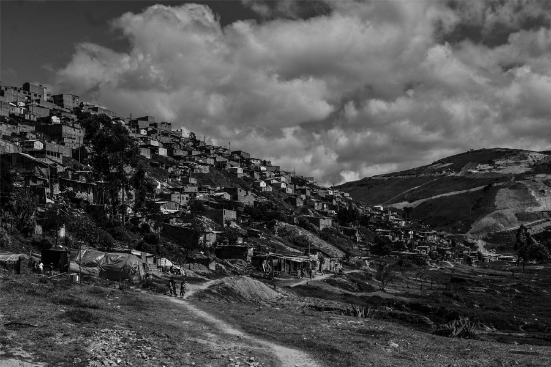

<!-- configuracion de colores es opcional pero ultil-->
<section id="themes">
	<h2>Configuración de temas</h2>
	

		Temas:  
		<a href="?#/themes">Default</a> -
		<a href="?theme=sky#/themes">Sky</a> -
		<a href="?theme=beige#/themes">Beige</a> -
		<a href="?theme=simple#/themes">Simple</a> -
		<a href="?theme=serif#/themes">Serif</a> -
		<a href="?theme=night#/themes">Night</a>  
		<a href="?theme=moon#/themes">Moon</a> -
		<a href="?theme=solarized#/themes">Solarized</a>
	

</section>

Slide:

# TRASHWARE LIBRE

Nicolás Gaitán Albarracín

Slide:

# Contenido

Pero primero, mira alrededor

Empezar a partir de lo que tienes

Elegir un buen nombre

Tener una misión clara 

Características y lista de requerimientos

Declarar que el proyecto es libre

Estado de desarrollo

Canales de Comunicación

Recursos

Slide:

## Pero primero, mira alrededor

1. [Verde binario](http://www.verdebinario.org/trashware-howto/)
2. [Proyecto Radis](http://www.progettoradis.it/)
3. [GOLEM](http://golem.linux.it/wp/)
4. [Faber Libertatis](http://faberlibertatis.org/w/images/3/30/Trashware@IPP2013Padova.pdf)

Subslide:

## 1. Verde binario

Es una asociación cultural fundada en 2002 y activa en el sur de Italia, con sede en Cosenza. Desde su creación Verde binario a trabajado en dos proyectos importantes. El primer proyecto, "Museo Interactivo de Arqueología de Computadores" , es una exposición permanente de ordenadores históricos,despues empezaron con el reciclaje tecnologico. 

Subslide:
## 1. Verde binario
Recuperan todos los PC que pueden encontrar y los llevan en sus laboratorios. Haciendo una instalación de GNU / Linux, donde reviven los PCs y los dejan listos para su uso. Las máquinas recuperadas se completan con monitor, ratón y teclado y entregados a cualquier persona que lo solicite detrás de una suscripción mínima para cubrir los gastos de vida y como una contribución a las actividades del Verde binario. 

En el momento la asociación cuenta con un punto de internet social pequeño, hecho enteramente con el hardware reciclado y el software libre!

Subslide:

## 2. Proyecto Radis

Radicados en la regiónde Asti en Italia. 
Un ordenador, incluso si es "viejo" está diseñado para ser usado y, por lo tanto, adquiere un valor que suele ser independiente de lo puramente comercial: El principio de Trashware es atribuir valor y dignidad a la satisfacción de la necesidad más que la máquina que lo permita.

Subslide:

## 2. Proyecto Radis

Ellos analizan los servicios que las maquinas a prestaran e identifican las computadoras con características y configuraciones de lo más compatible posible con el uso de que se dedicará. Seleccionan el software adecuado, apoyan la instalación e imparten una formación básica sobre herramientas operativas. 
Desde la sencilla operación de entrega de un ordenador se encuentra un trabajo más delicado, la evaluación, la investigación, la parametrización, la configuración y la consultoría.

Actualmente han realizado 47 proyectos y tienen otros 10 en curso.

Subslide:

## 3. GOLEM

Son una asociación de voluntarios conforamada en 2004 en la ciudad de Empoli Italia que procede al reacondicionamiento del equipo desechado, instalar muchos programas, abiertos y útiles, y luego donan los equipos a los que lo necesitan.

Subslide:

## 4. Faber Libertatis

Proyectos de SL y Trashware para escuelas, puntos gratuitos de internet para paises en desarrollo y para actividades públicas. Desarrollaron proyectos en Senegal, Congo, Sierra Leona e India.

Subslide:
## 4. Faber Libertatis

Los objetivos son:

Subslide:
## 4. Faber Libertatis
Promover el acceso a las TIC por parte de los que están excluidos por razones económicas, sociales, culturales o personales, ya sea italiano o extranjero, residente en Italia o en otra nación.

Fomentar la recuperación y restauración de hardware en desuso o disponibles a bajo costo.

Subslide:
## 4. Faber Libertatis
Promover y difundir el uso de software para equipos electrónicos, en adelante simplemente llamado software libre publicado bajo la licencia GNU GPL, LGPL o FDL elaborado por la Fundación para el Software Libre, o autorizado por la Free Software Foundation declara compatible con ellos, o con licencia prueba libre de acuerdo con las directrices aprobadas por la junta de accionistas y registradas en el reglamento de ejecución.

Subslide:
## 4. Faber Libertatis
Difundir el uso consciente de las herramientas informáticas, hardware y software.

Promover la accesibilidad del software libre a través del desarrollo de un nuevo software libre, el mantenimiento de la existente y la traducción en los idiomas italiano o de otro tipo de la documentación y el software en sí.

Difundir el conocimiento de los problemas ecológicos, sociales, culturales y los beneficios económicos derivados de un uso indebido o tecnología de la información desigual y contribuir a su resolución.

Slide:
# Empezar a partir de lo que tienes
1. [Lliurex](http://mestreacasa.gva.es/web/lliurex/)
2. [Edubuntu](http://www.edubuntu.org/)
3. Comparativo educar con SP vs. SL

Subslide:
##1. LlIurex

Subslide:
##1. LlIurex
Es una distribución Linux que utiliza el entorno de escritorio GNOME,  realizada por la Consejería de Educación, Cultura y Deporte de la Generalidad Valenciana, su objetivo principal es la introducción de las nuevas tecnologías de la información y la comunicación basadas en software libre en el sistema educativo de la Comunidad Valenciana.

Subslide:
##1. LlIurex

Subslide:
##2. Edubuntu

Subslide:
##2. Edubuntu
Es un movimiento de base, elobjetivo es conseguir implementar Ubuntu en escuelas, hogares y comunidades y que sea fácil para los usuarios instalar y mantener sus sistemas.

Son estudiantes, maestros, padres de familia y hackers que creen que el aprendizaje y el conocimiento deben estar disponibles para todos los que quieren mejorarse a sí mismos y el mundo que les rodea.

Subslide:
##3. Comparativo educar con SP vs. SL

Subslide:
##3. Comparativo educar con SP vs. SL

Subslide:
##3. Comparativo educar con SP vs. SL

Subslide:
##3. Comparativo educar con SP vs. SL

Slide:
#Elegir un buen nombre

Subslide:
#TRASHWARE LIBRE
Subslide:

Slide:
#Tener una misión clara 

Subslide:
Generar y trasferir un modelo de administración de un laboratorio de computo basado en Edubuntu/Lliurex que permita ser administrado por personal con limitados conocimientos técnicos.

Slide:
#Declarar que el proyecto es libre

Subslide:
Debido a que los equipos usados en el proyecto son reciclados, sus características técnicas no son las más recientes por eso el uso de versiones livianas de Software Libre son las más apropiadas.

Slide:
#Características y lista de requerimientos

Subslide:
Para poder tener un rendimiento adecuado de LLiurex y Edubuntu los equipos deben haber sido comprados antes de 2003, las características específicas son las siguientes:

Al menos un procesador Pentium IV.

Memoria RAM al menos 256 MB de memoria.

Discos duros al menos 10 gigabytes.

Monitores no menores a 15”.

Slide:
# Estado de desarrollo

Subslide:
Actualmente se acabó de evaluar el estado de la sala después de no haberla visitado durante 1 año por razones de seguridad, por daño o pérdida es necesario reemplazar 4 memorias RAM y 2 discos duros.
Del total de 12 unidades en el momento de visitar la sala se encontró que tan solo 7 tenían instalado un sistema operativo libre, el resto tenían instala Windows XP; sin embargo en la visita se hizo la migración de estos equipos a Ubuntu 10.1.

Subslide:
El proyecto se encuentra en una segunda etapa donde se superó un piloto, se hace la evaluación de los resultados de la primera etapa.
En estos momentos el proyecto se enfoca en 
Seleccionar entre Lliurex y Edubuntu como única distribución de la sala.
Generar un sistema de administración que pueda ser manejado por personal sin grandes conocimientos técnicos.
Trasferir la sala de computo instalada a los practicantes de trabajo social que tienen un trabajo continúo en la escuela

Slide:
#Canales de Comunicación

Subslide:
El proyecto se divulgara en los distintos espacios comunales del barrio.
Ya se realizó un paper sobre la primera etapa del proyecto 
[Trashware para el desarrollo social y sostenible](https://www.academia.edu/2049756/Trashware_para_el_desarrollo_social_y_sostenible)

Se está buscando realizar otro enfocado hacia presentar el modelo de administración de la sala.

Slide:
# Recursos

* [Verde binario](http://www.verdebinario.org/trashware-howto/)
* [Proyecto Radis](http://www.progettoradis.it/)
* [GOLEM](http://golem.linux.it/wp/)
* [Faber Libertatis](http://faberlibertatis.org/w/images/3/30/Trashware@IPP2013Padova.pdf)
* [Lliurex](http://mestreacasa.gva.es/web/lliurex/)
* [Edubuntu](http://www.edubuntu.org/)
* Romero, Martine, Gaitan, Huertas2011.Primera Convocatoria Nacional de Extensión Solidaría Universidad Nacional de Colombia:Apuestas para construir país Proyecto TRASHWARE

Subslide:
# Recursos
* Heinz, F. (2006). ¿Qué tiene que ver Software Libre con educación? In B. Busaniche (Ed.), Prohibido Pensar, Propiedad Privada. Los monopolios sobre la vida, el conocimiento y la cultura. Cordoba: Fundación Via Libre. 

* Martínez , J. H. (2010). La inteligencia de negocios como herramienta para la toma de decisiones estratégicas en las empresas. Análisis de su aplicabilidad en el contexto corporativo colombiano. . Maestría en Administración, Universidad Nacional de Colombia, Bogotá. Retrieved from http://www.bdigital.unal.edu.co/3098/1/940607.2010a.pdf  

Subslide:
# Recursos

* Salgado, A. (2011). Obsolecencia programada, deloberado acto de disenar productos que fallen pronto, incrementar el desperdicio y destruir y envenenar el medio ambiente. , from http://www.argenpress.info/2011/11/obsolescencia-programada-deliberado.html

* Serrano, A., & Martínez, E. (2003). La brecha digital: Mitos y realidades. Baja California: Departamento Editorial Universitaria de la Universidad Autónoma de Baja California.
